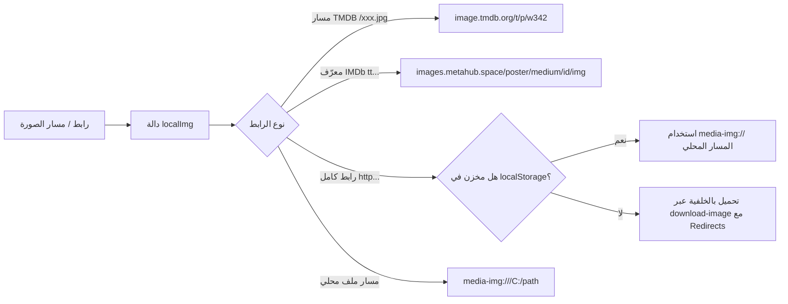

# 🛠️ دليل المطور والمرجع التقني الشامل — MEEM (Play Anything. Anytime.)

> **وثيقة مرجعية تقنية متقدمة لكود وهندسة MEEM**  
> هذا الدليل تم تجميعه وكتابته بناءً على التحليل الفعلي لكافة ملفات الكود ومسارات الـ IPC والبروتوكولات والمكتبات المستخدمة.

---

## 📑 فهرس الدليل التقني
1. [نظرة عامة على معمارية النظام (System Architecture)](#1-نظرة-عامة-على-معمارية-النظام)
2. [هيكل المجلدات ومسؤوليات الملفات (Codebase Structure)](#2-هيكل-المجلدات-ومسؤوليات-الملفات)
3. [خريطة قنوات الـ IPC والاتصال بين العمليات (IPC Map & Bridge)](#3-خريطة-قنوات-الـ-ipc-والاتصال-بين-العمليات)
4. [البروتوكولات المخصصة وإدارة الوسائط المحلية (Custom Protocols)](#4-البروتوكولات-المخصصة-وإدارة-الوسائط-المحلية)
5. [خط أنابيب الصور والبوسترات (Image & Poster Pipeline)](#5-خط-أنابيب-الصور-والبوسترات)
6. [محرك فحص الشبكة وحالة الاتصال (Network & Connectivity Engine)](#6-محرك-فحص-الشبكة-وحالة-الاتصال)
7. [محرك البث والتورنت (Streaming & Torrent Engine)](#7-محرك-البث-والتورنت)
8. [بنية مشغل الفيديو والترجمات (Player & Subtitle Subsystem)](#8-بنية-مشغل-الفيديو-والترجمات)
9. [إدارة البيانات وقاعدة البيانات المحلية (Store & Data Schema)](#9-إدارة-البيانات-وقاعدة-البيانات-المحلية)
10. [نظام المزامنة والحسابات والشبكة الاجتماعية (Sync & Social Layer)](#10-نظام-المزامنة-والحسابات-والشبكة-الاجتماعية)
11. [دليل التطوير والتصحيح (Debugging & Maintenance Guide)](#11-دليل-التطوير-والتصحيح)

---

## 1. نظرة عامة على معمارية النظام

يعتمد التطبيق على نموذج **Electron Multi-Process Architecture** مع عزل بيئة العرض وتأمين الـ Context Bridge:

```
┌────────────────────────────────────────────────────────────────────────┐
│                        MAIN PROCESS (Node.js 20+)                      │
│  - Runtime: Electron 30+ / Node.js                                     │
│  - Entrypoint: main.js                                                 │
│  - Core Services: Store, Streamer, Addons, SubtitleManager, Scrapers   │
│  - Protocols: media-img://, local-file://                              │
└───────────────────────────────────┬────────────────────────────────────┘
                                    │ IPC Invoke / Send (Safe Bridge)
┌───────────────────────────────────▼────────────────────────────────────┐
│                        PRELOAD SCRIPT (preload.js)                     │
│  - Context Isolation: contextBridge.exposeInMainWorld('api', {...})    │
│  - Whitelisted Channel Handlers & Event Listeners                      │
└───────────────────────────────────┬────────────────────────────────────┘
                                    │ window.api
┌───────────────────────────────────▼────────────────────────────────────┐
│                    RENDERER PROCESS (Chromium UI)                      │
│  - DOM & State: renderer.js, state.js, bridge.js                       │
│  - Feature Modules: auth.js, anime.js, iptv.js, player.js, library.js │
│  - Custom Elements: <tmdb-image>                                       │
│  - Video Engine: Shaka Player 5.x + JavascriptSubtitlesOctopus (WASM)  │
└────────────────────────────────────────────────────────────────────────┘
```

---

## 2. هيكل المجلدات ومسؤوليات الملفات

```
MediaVault v2/
├── main.js                     # المدخل الرئيسي للـ Electron، النوافذ، والبروتوكولات
├── package.json                # التبعيات وسكربتات التشغيل والبناء
├── capacitor.config.json       # إعدادات Capacitor لتطبيق الأندرويد
├── src/
│   ├── main/                   # خدمات الـ Main Process (Node.js)
│   │   ├── store.js            # محرك قاعدة البيانات والتخزين المحلي JSON
│   │   ├── streamer.js         # محرك بث ملفات التورنت والروابط المغناطيسية
│   │   ├── downloader.js       # محرك إدارة التنزيلات المتزامنة
│   │   ├── addons.js           # مدير إضافات Stremio وموفري البحث الموحد
│   │   ├── libraryScanner.js   # الماسح التلقائي لمجلدات الفيديو وتحديد العناوين
│   │   ├── SubtitleManager.js  # البحث عن الترجمات وجلبها وتنسيقها
│   │   ├── StremioAddonService # الاتصال ببروتوكول إضافات Stremio v3
│   │   ├── TraktService.js     # المزامنة مع منصة Trakt.tv
│   │   └── ipc/                # معالجات قنوات الـ IPC المقسمة
│   │       ├── metadata.js     # جلب وتخزين الميتا داتا والبوسترات
│   │       ├── iptv.js         # معالجة قوائم وتشغيل IPTV
│   │       ├── radio.js        # جلب محطات الراديو
│   │       ├── subtitle.js     # قنوات الترجمة
│   │       ├── fileManage.js   # قراءة وحفظ الملفات المحلية
│   │       ├── mediaPlay.js    # التحكم في المشغل والعتاد
│   │       └── profileConfig.js# إعدادات البروفايل والأمان
│   └── renderer/               # واجهة المستخدم والموديولات (Chromium)
│       ├── index.html          # الهيكل الأساسي للـ SPA والـ Modals
│       ├── renderer.js         # المنطق الرئيسي للواجهة وتهيئة العناصر
│       ├── preload.js          # جسر الأمان بين الـ Main والـ Renderer
│       ├── modules/            # موديولات الميزات المنفصلة
│       │   ├── auth.js         # الحسابات، البروفايل، قفل الأطفال، الثيمات
│       │   ├── player.js       # واجهة وتحكم مشغل الفيديو ومزامنة الوقت
│       │   ├── anime.js        # واجهة وجداول بث الأنمي
│       │   ├── iptv.js         # واجهة وقوائم التلفزيون المباشر
│       │   ├── radio.js        # واجهة محطات الراديو
│       │   ├── library.js      # واجهة المكتبة والملفات المحلية
│       │   ├── settings.js     # صفحة الإعدادات العامة
│       │   └── ass-subtitles.js# ربط مكتبة LibASS لتشغيل ترجمات ASS
│       └── js/                 # المكتبات المساعدة
│           ├── bridge.js       # طبقة التوافق بين Capacitor و Electron
│           ├── state.js        # إدارة الحالة العامة للتطبيق (Global State)
│           ├── detail-unified  # صفحة التفاصيل الموحدة للعمل
│           ├── social-presence # خوادم المحادثة والـ Watch Party
│           └── shaka-player    # مكتبة مشغل الفيديو Shaka Player
```

---

## 3. خريطة قنوات الـ IPC والاتصال بين العمليات

يتم استدعاء خدمات الـ Node.js من الواجهة عبر `window.api.invoke(channel, args)` أو `window.api.send(channel, args)`.

### 📡 أهم قنوات الـ IPC:
| القناة (Channel) | الملف المعالج | الوظيفة |
| :--- | :--- | :--- |
| `check-network-status` | [`main.js`](file:///c:/Users/motawa/Documents/Vault-Workspace/MediaVault%20v2/main.js) | فحص مباشر لحالة الاتصال الحقيقية بالإنترنت عبر DNS/Sockets |
| `download-image` | [`metadata.js`](file:///c:/Users/motawa/Documents/Vault-Workspace/MediaVault%20v2/src/main/ipc/metadata.js) | تنزيل صورة مع تتبع الـ Redirects وحفظها في `BANNERS_DIR` |
| `cinemeta-catalog` | [`metadata.js`](file:///c:/Users/motawa/Documents/Vault-Workspace/MediaVault%20v2/src/main/ipc/metadata.js) | جلب كتالوجات Cinemeta المنسقة |
| `start-torrent-stream` | [`main.js`](file:///c:/Users/motawa/Documents/Vault-Workspace/MediaVault%20v2/main.js) | تشغيل بث ملف تورنت أو رابط Magnet عبر خادم محلي |
| `stop-torrent-stream` | [`main.js`](file:///c:/Users/motawa/Documents/Vault-Workspace/MediaVault%20v2/main.js) | إيقاف محرك التورنت وتحرير الموارد والمنافذ |
| `scan-local-library` | [`libraryScanner.js`](file:///c:/Users/motawa/Documents/Vault-Workspace/MediaVault%20v2/src/main/libraryScanner.js) | مسح المجلدات المحلية واستخراج العناوين والحلقات |
| `search-subtitles` | [`SubtitleManager.js`](file:///c:/Users/motawa/Documents/Vault-Workspace/MediaVault%20v2/src/main/SubtitleManager.js) | البحث عن ملفات الترجمة للفيلم أو الحلقة |
| `save-store` / `load-store` | [`store.js`](file:///c:/Users/motawa/Documents/Vault-Workspace/MediaVault%20v2/src/main/store.js) | حفظ وقراءة قاعدة بيانات `data.json` للمستخدم |

---

## 4. البروتوكولات المخصصة وإدارة الوسائط المحلية

لضمان تجاوز قيود الأمان لـ Chromium وتوفير دعم التقديم والترجيع (Range Requests):

1. **بروتوكول `media-img://`:**
   - معرف في `main.js` لمعالجة طلبات الصور والبنرات المحلية بدون التعرض لحظر `webSecurity`.
   - يقوم بفك تشفير المسارات بأمان، فحص وجود الملف على القرص في `BANNERS_DIR`، وإرجاع ترويسات الـ MIME المناسبة.
2. **بروتوكول `local-file://`:**
   - مخصص لتشغيل ملفات الفيديو والصوت المحلية الكبيرة مع دعم ترويسات `Range: bytes=start-end` لتمكين الـ Seeking الفوري.

---

## 5. خط أنابيب الصور والبوسترات

### مسار معالجة وعرض الصورة:


### القواعد المعيارية لمكون `<tmdb-image>`:
- إذا كان المسار يبدأ بـ `/tt` أو `tt` ──► يوجه لـ `https://images.metahub.space/poster/medium/${id}/img`.
- إذا كان يبدأ بـ `/` واسم ملف TMDB ──► يوجه لـ `https://image.tmdb.org/t/p/${size}${path}`.

---

## 6. محرك فحص الشبكة وحالة الاتصال

لتجنب مشاكل قراءات Chromium الخاطئة على أنظمة ويندوز:
- **في الـ Main Process:**
  - يتم فحص الاتصال عبر `probeNodeConnectivity()` التي تستخدم `dns.promises.lookup('google.com')` أو مقبس مباشر لـ `https://1.1.1.1`.
  - عند تغير الحالة، يتم بث حدث `connectivity-changed` للواجهة.
- **في الـ Renderer:**
  - دالة `checkRealOnlineStatus()` تعتمد على الـ IPC المباشر، وتتحكم في إظهار أو إخفاء `#btn-offline-status`.

---

## 7. محرك البث والتورنت

- **التشغيل المباشر:** يعتمد على `streamer.js` الذي ينشئ خادم HTTP محلي (Node HTTP Server) ويقوم ببث قطع الفيديو تدريجياً (Sequential Pieces) إلى المشغل.
- **تحويل التنسيقات (Transcoding):** يدعم التحويل اللحظي للملفات ذات الترميزات غير المدعومة في المتصفح باستخدام FFmpeg المدمج.

---

## 8. بنية مشغل الفيديو والترجمات

- **محرك التشغيل:** `Shaka Player 5.x` المدمج في `src/renderer/js/shaka-player.compiled.js` و `modules/player.js`.
- **محرك الترجمات الاحترافي:** `JavascriptSubtitlesOctopus` (المعتمد على LibASS عبر WebAssembly) في `src/renderer/lib/libass-wasm/` لمعالجة ترجمات `.ass` المعقدة بما تشمله من خطوط ومؤثرات حركية ومواقع دقيقة على الشاشة.

---

## 9. إدارة البيانات وقاعدة البيانات المحلية

- **مكان التخزين:** مسار بيانات التطبيق في نظام التشغيل (`app.getPath('userData')`).
- **الملف الأساسي:** `data.json`
- **المجلدات الإضافية:**
  - `banners/` (الصور والبوسترات المحفوظة محلياً)
  - `subtitles/` (ملفات الترجمة المحملة)
  - `torrents/` (بيانات التورنت المؤقتة)

---

## 10. نظام المزامنة والحسابات والشبكة الاجتماعية

- يتم استخدام عميل `Supabase` المدمج في [`src/renderer/js/supabase.js`](file:///c:/Users/motawa/Documents/Vault-Workspace/MediaVault%20v2/src/renderer/js/supabase.js) لإدارة المصادقة السحابية والمزامنة بين الأجهزة.
- تدير موديول `social-presence.js` قنوات الـ Realtime لمزامنة حالة التشغيل وغرف الـ Watch Party ورسائل المحادثة.

---

## 11. دليل التطوير والتصحيح

### 🛠️ أوامر التشغيل الأساسية:
```bash
# تشغيل التطبيق في وضع الإنتاج
npm start

# تشغيل التطبيق مع فتح DevTools
npm run dev

# فحص جودة الكود
npm run lint

# بناء نسخة التثبيت لنظام Windows
npm run build
```

### 🐞 إرشادات تصحيح الأخطاء (Debugging Tips):
1. **فتح أدوات المطورين (DevTools):** اضغط `Ctrl + Shift + I` في أي وقت داخل التطبيق.
2. **سجلات الـ Main Process:** يتم تسجيل كافة رسائل النظام والـ IPC في ملف `debug.log` الموجود في المجلد الرئيسي.
3. **تفريغ كاش الصور عند الحاجة:** يمكن تنفيذ `localStorage.clear()` من كونسول الـ DevTools لإعادة جلب كافة الصور من خوادمها مباشرة.
