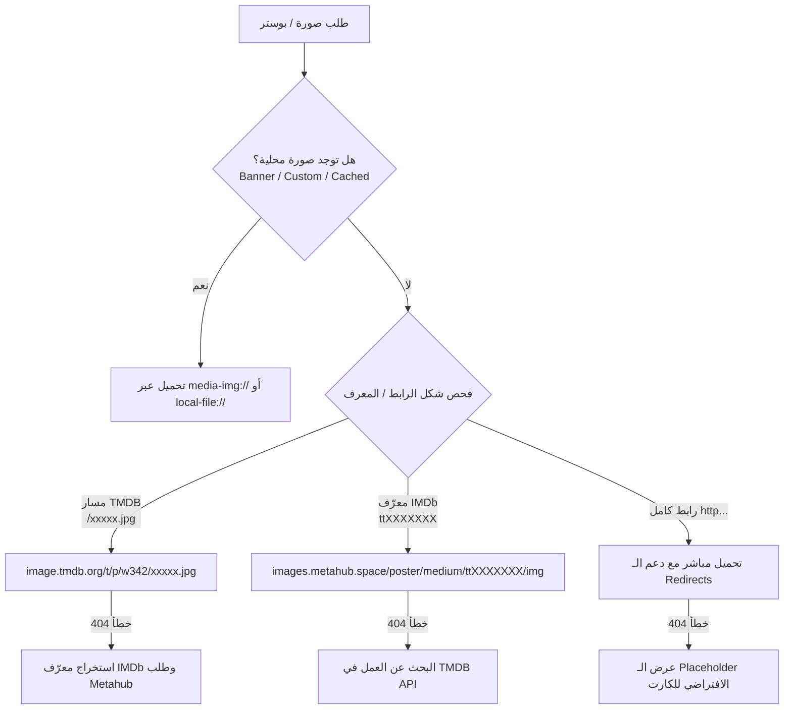

# MediaVault v2 — System Architecture & Debugging Reference

> **ملف التوثيق المعماري والتحليلي الشامل لكود MediaVault v2**  
> تم إنشاء هذا التوثيق بناءً على الفحص الفعلي للكود والتحليل المباشر للملفات واختبار الاتصال الفعلي بالخوادم.

---

## 1. الهيكل المعماري الأساسي (Application Architecture)

يعتمد التطبيق على بيئة **Electron** للحاسوب، مع تجهيز **Capacitor** لنظام Android.

```
┌────────────────────────────────────────────────────────────────────────┐
│                        MAIN PROCESS (Node.js)                          │
│  main.js ──► src/main/ipc/*.js (metadata, torrents, store, scraper...) │
│  - إدارة النوافذ ودورة حياة التطبيق                                      │
│  - بروتوكولات مخصصة: media-img:// و local-file://                       │
│  - جلب وتنزيل الصور والملفات عبر Node.js                                │
│  - مراقبة حالة الاتصال بالإنترنت                                       │
└───────────────────────────────────┬────────────────────────────────────┘
                                    │ IPC Bridge (preload.js)
┌───────────────────────────────────▼────────────────────────────────────┐
│                       RENDERER PROCESS (Chromium)                      │
│  index.html ──► renderer.js, modules/*.js, css/*.css                   │
│  - واجهة المستخدم التفاعلية (Discover, Library, Shows, Movies, Player)  │
│  - إدارة التخزين المحلي والـ Cache (localStorage, appData)             │
│  - معالجة وعرض البوسترات (<tmdb-image>, localImg)                      │
└────────────────────────────────────────────────────────────────────────┘
```

---

## 2. تحليل مشكلة الأوفلاين (Why the App Always Says "Offline")

### 🔍 ما يحدث فعلياً في الكود:
1. **الـ Main Process (`main.js`):**
   - الكود يستدعي `net.isOnline()` الخاصة بـ Electron.
   - على أنظمة ويندوز، في حال وجود محولات شبكة افتراضية (Hyper-V, WSL, Docker, VPN) فإن Chromium يُرجع `false` بشكل خاطئ.
   - عند محاولة التحقق عبر `probeUrl()`, يتم استخدام `net.request({ method: 'HEAD', url })`.
   - **الخلل:** دالة `net.request` تتبع لمحرك Chromium؛ وبما أن المحرك اعتبر الجهاز غير متصل، فإنه يُسقط الطلب فوراً بخطأ `ERR_INTERNET_DISCONNECTED` دون الخروج للشبكة، فيفشل الفحص البديل ويتم إرسال `{ isOnline: false }` للـ Renderer كل 15 ثانية.

2. **الـ Renderer (`renderer.js` و `modules/auth.js`):**
   - عند استقبال `{ isOnline: false }`، يستدعي دالة `updateOfflineStatusIndicator(false)`.
   - تحاول الدالة استدعاء `fetch(url, { mode: 'no-cors' })` وتفشل لنفس السبب، مما يثبت زر `#btn-offline-status` في حالة ظهور مستمر.

### 💡 الحل المؤكد:
في الـ Main Process، الاعتماد على `dns.lookup('google.com')` أو اتصال `https.get` باستخدام مقابس Node.js الأصلية المباشرة (OS Socket) التي تتجاوز قرارات Chromium الداخلية.

---

## 3. التحليل الشامل لمصادر الصور ومشاكل البوسترات (Image Pipeline)

### 🚨 اكتشاف جوهري من الاختبار المباشر لروابط الـ CDN:
خلال الفحص، تبين وجود خطأ فادح في الكود تم كتابته سابقاً:
- كان هناك كود يقوم باستبدال نطاق `images.metahub.space` بنطاق `v3-cinemeta.strem.io` وتحويل الرابط إلى `/poster.jpg` ظناً أن metahub معطل.
- **الحقيقة التي أثبتها الاختبار المباشر:**
  - `https://images.metahub.space/poster/medium/tt0111161/img` ──► **يعمل بنجاح (200 OK)**.
  - `https://v3-cinemeta.strem.io/poster/medium/tt0111161/poster.jpg` ──► **يرجع خطأ (404 Not Found)** لأن خادم Cinemeta يقدم الـ JSON API فقط ولا يستضيف ملفات الصور مباشرة!
- هذا الاستبدال الخاطئ تسبب في كسر معظم صور Cinemeta.

---

### 🌐 نتائج فحص الخوادم الحية (Live Endpoint Verification):

| المصدر / الخادم | الرابط النموذجي | الحالة الفعلية | الملاحظات |
| :--- | :--- | :---: | :--- |
| **TMDB Official CDN** | `https://image.tmdb.org/t/p/w342/...` | **200 OK** ✅ | فائق السرعة والموثوقية، الخيار الأول للصور. |
| **Metahub Images CDN** | `https://images.metahub.space/poster/medium/{id}/img` | **200 OK** ✅ | شغال بنجاح لمعرّفات IMDb (`tt...`). |
| **Cinemeta Metadata API** | `https://v3-cinemeta.strem.io/meta/{type}/{id}.json` | **200 OK** ✅ | خاص بجلب البيانات الوصفية، لا يستضيف الصور مباشرة. |
| **TMDB ElfHosted Proxy** | `https://tmdb.elfhosted.com/meta/...` | **Timeout / بطيء** ⚠️ | سيرفر مجتمعي بطيء ويتوقف كثيراً، يجب تجنب الاعتماد عليه كمسار رئيسي. |
| **AniList CDN** | `https://s4.anilist.co/file/anilistcdn/...` | **200 OK** ✅ | ممتاز لبوسترات الأنمي. |
| **Dicebear Avatars** | `https://api.dicebear.com/7.x/...` | **200 OK** ✅ | ممتاز للأفاتارات الافتراضية وصور الموسيقى. |

---

### 🗺️ الخريطة المقترحة والأنظف لمعمارية الصور (Recommended Image Architecture)

بدلاً من الخلط وتكرار الطلبات، يتم توحيد مسارات الصور بناءً على نوع المعرّف (ID Resolution Hierarchy):



---

## 4. أخطاء التحميل البرمجية في كود الصور الحالي

1. **الـ Redirects في `download-image` (`metadata.js`):**
   - دالة `https.get` في Node.js لا تتبع أكواد `301` و `302`. عند توجيه الـ CDN للطلب لموقع آخر، يُسقطه الكود لأن `res.statusCode !== 200`.
   - **التصحيح:** إضافة دالة تتبع التحويلات (Redirect Follower) حتى 3 مستويات.

2. **خطأ `<tmdb-image>` في `renderer.js`:**
   - يضيف بادئة TMDB تلقائياً لأي مسار يبدأ بـ `/` حتى لو كان معرّف IMDb مثل `/tt0111161`.
   - **التصحيح:** التأكد أولاً هل المسار يبدأ بـ `/tt` لتوجيهه إلى Metahub بدلاً من TMDB.

3. **حماية دالة `btoa` في `localImg`:**
   - استخدام `encodeURIComponent` أو ترميز آمن قبل `btoa` لمنع استثناءات الأحرف الخاصة.

---

## 5. خريطة الملفات الرئيسية للتطبيق (Codebase Map)

| المسار | الوظيفة الأساسية |
| :--- | :--- |
| [`main.js`](file:///c:/Users/motawa/Documents/Vault-Workspace/MediaVault%20v2/main.js) | نقطة انطلاق Electron، إدارة البروتوكولات `media-img://`، مراقبة الإنترنت، توجيه IPC. |
| [`src/main/ipc/metadata.js`](file:///c:/Users/motawa/Documents/Vault-Workspace/MediaVault%20v2/src/main/ipc/metadata.js) | معالجة جلب الميتا داتا، البحث، وتنزيل الصور عبر `download-image`. |
| [`src/main/store.js`](file:///c:/Users/motawa/Documents/Vault-Workspace/MediaVault%20v2/src/main/store.js) | إدارة قاعدة البيانات والتخزين المحلي، مجلدات `BANNERS_DIR`. |
| [`src/renderer/renderer.js`](file:///c:/Users/motawa/Documents/Vault-Workspace/MediaVault%20v2/src/renderer/renderer.js) | منطق الواجهة الرئيسي، إدارة الكروت `createMediaCard`، دالة `localImg`، ومكون `<tmdb-image>`. |
| [`src/renderer/modules/auth.js`](file:///c:/Users/motawa/Documents/Vault-Workspace/MediaVault%20v2/src/renderer/modules/auth.js) | إدارة الحسابات، الأفاتار، والتحقق من حالة الاتصال الأولية. |
| [`src/renderer/modules/anime.js`](file:///c:/Users/motawa/Documents/Vault-Workspace/MediaVault%20v2/src/renderer/modules/anime.js) | معالجة وسحب بيانات وبوسترات الأنمي (AniList/Kitsu/MAL). |
| [`src/renderer/js/detail-unified.js`](file:///c:/Users/motawa/Documents/Vault-Workspace/MediaVault%20v2/src/renderer/js/detail-unified.js) | صفحة تفاصيل العمل، عرض الخلفيات والبوسترات وقوائم الحلقات. |
